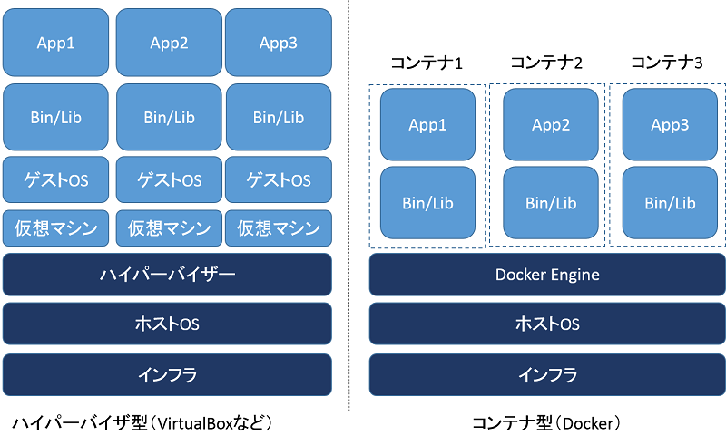

# Docker Study #01

---

# Overview

- 軽量な仮想化環境を実現するためのツール
- OSやアプリケーションを設定したものを丸ごと実行イメージとして保存できる
- Dockerが導入されている別のマシンにそのまま持っていくことができる
- 「Build onece, run anywhere」と呼ばれ、環境の違いを意識することなくアプリケーションを導入できる

---



---

# Install

## Docker For Mac (brew cask)

```
$ brew cask install docker
```

## Docker For Mac (dmg)

https://www.docker.com/docker-mac

# GUI Settings

```
$ open /Applications/Docker.app
```
